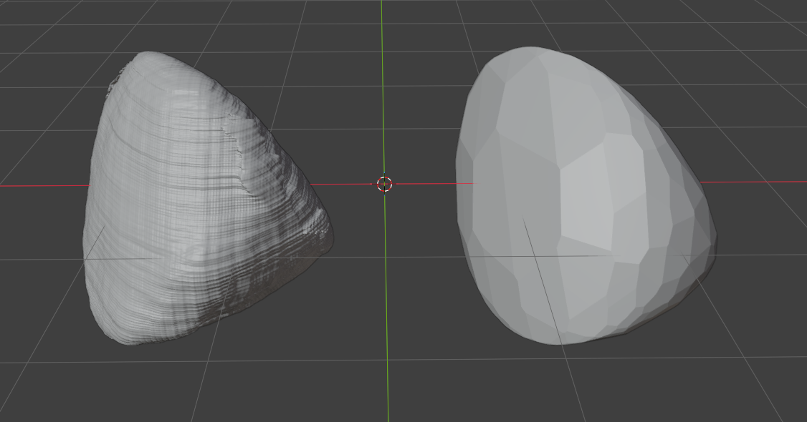

# Lightcurve-Based Asteroid Shape Reconstruction

This project reconstructs 3D asteroid-like shapes from simulated multi-camera
lightcurves using a neural Signed Distance Function (SDF) representation.

The model encodes binary and intensity lightcurves into a latent shape
representation and predicts SDF values for arbitrary 3D query points.
The reconstructed zero level set is converted into an STL mesh using
Marching Cubes.

The project was developed in the context of the **Helsinki Asteroid Challenge
2026**. The challenge provides lightcurves derived from real-world 
observations and Blender-based simulations. Its objective is to reconstruct
the corresponding three-dimensional asteroid geometries from these
lightcurve measurements.

## Objective

The goal is to investigate whether simulated lightcurves from multiple viewing
directions contain sufficient information to reconstruct the approximate 3D
geometry of asteroid-like objects.

The reconstruction pipeline is:


$$
\text{STL mesh}
\rightarrow
\text{lightcurve simulation}
\rightarrow
\text{neural encoder}
\rightarrow
\text{latent code}
\rightarrow
\text{SDF decoder}
\rightarrow
\text{STL reconstruction}
$$


## Method Overview

### Input data

Each sample consists of:

- an asteroid-like STL mesh,
- a binary lightcurve,
- an intensity lightcurve,
- sampled 3D query points,
- corresponding truncated signed distance values,
- the object radius.

The lightcurve tensor has the shape:


$$
(B, M, C, F)
$$


where:

- $B$ is the batch size,
- $M$ is the number of modalities,
- $C$ is the number of cameras,
- $F$ is the number of rotation frames.

### Shape representation

The shape is represented as a Signed Distance Function:


$$
f(x, y, z) \rightarrow d
$$


where $d$ is the signed distance to the surface.

Typically:


$$
d < 0
\quad \text{inside the object}
$$


$$
d = 0
\quad \text{on the surface}
$$


$$
d > 0
\quad \text{outside the object}
$$


For training, the SDF values are truncated and normalized to a bounded range.

### Neural network

The model consists of two parts:

1. `LightcurveEncoderResidual`  
   A residual 1D convolutional encoder with circular padding. It processes
   periodic lightcurve signals and produces a latent object representation.

2. `SDFDecoder2`  
   An MLP that predicts SDF values from:
   - the latent representation,
   - positional-encoded 3D query points,
   - the normalized object radius.

Positional encoding is used to help the decoder represent fine geometric
details:


$$
\gamma(\mathbf{p}) =
\left[
\mathbf{p},
\sin(\pi\mathbf{p}),
\cos(\pi\mathbf{p}),
\dots
\right]
$$


## Repository Structure

```text
project-root/
├── scripts/
│   ├── add_craters_to_data.py
│   ├── generate_bones.py
│   ├── generate_cube.py
│   ├── generate_orbs.py
│   ├── generate_rotated_original.py
│   ├── generate_sdfsamples.py
│   ├── generate_polygons.py
│   ├── generate_lightcurves.py
│   ├── reconstruct_by_lightcurve.py
│   ├── trainnet_sdf.py
│   └── ...
│
├── data/
│   ├── dataset/
│   │   └── ...
│   └── secretasteroids/
│       ├── reconstructions/
│       └── ...
│
├── docs/
│   └── ...
│
├── src/
│   └── lightcurve_fips/
│       ├── data/
│       │   ├── datasets.py
│       │   ├── generatedata.py
│       │   ├── generatepolygons.py
│       │   └── lightcurves.py
│       │
│       ├── evaluation/
│       │   └── evaluate.py
│       │
│       ├── models/
│       │   ├── lightcurve_encoder.py
│       │   └── sdf_decoder.py
│       │
│       ├── rendering/
│       │   └── camera_setup.py
│       │
│       └── training/
│           └── utils.py
│
├── checkpoints/
│   └── final_model.pth
│
└── README.md
```

## Installation

The project requires Python 3.x and a CUDA-capable GPU for efficient
lightcurve generation and model training.

Install the required packages:

```bash
pip install -r requirements.txt
```

## Typical Workflow

The typical pipeline consists of the following steps:

1. Generate or import asteroid meshes.
2. Generate simulated multi-camera lightcurves.
3. Generate SDF training samples from the STL meshes.
4. Train the lightcurve-to-SDF network.
5. Reconstruct an STL mesh from lightcurve inputs.
6. Evaluate the reconstruction against a ground-truth mesh.

Example commands:

```bash
python scripts/generate_bones.py
python scripts/generate_lightcurves.py
python scripts/generate_sdfsamples.py
python scripts/trainnet_sdf.py
python scripts/reconstruct_by_lightcurve.py
```

## Data Format

Each dataset sample is stored in a separate directory and can contain:

```text
sampleX/
├── asteroid_radius<radius>.stl
├── lc_bin_<mesh_name>.csv
├── lc_intens_<mesh_name>.csv
├── points_<n_points>_<index>.npy
└── sdf_<n_points>_<index>.npy
```
### Coordinate Convention

Meshes are normalized before SDF sampling and network training.

The horizontal coordinates are normalized using the object radius $r$:


$$
x_{\mathrm{norm}} = \frac{x}{r},
\qquad
y_{\mathrm{norm}} = \frac{y}{r}.
$$


The mesh is rotated and uniformly scaled so that its vertical extent satisfies:


$$
z_{\min} = -1,
\qquad
z_{\max} = 1.
$$


The radius used by the network is normalized by a global maximum radius:


$$
r_{\mathrm{model}} = \frac{r}{r_{\max}}.
$$


SDF values are truncated at a distance $\tau$ and normalized to
the interval $[-1, 1]$:


$$
\mathop{\text{TSDF}}(\mathbf{x}) =
\frac{
\mathop{\text{clip}}
\left(
\mathop{\text{SDF}}(\mathbf{x}),
-\tau,
\tau
\right)
}{\tau}.
$$

## Training

The network is trained to predict truncated signed distance values at sampled
3D query points.

The model input consists of:

- binary lightcurves,
- intensity lightcurves,
- normalized object radius,
- 3D query points.

The model predicts one SDF value for each query point.

Training uses a weighted Smooth L1 loss. Points near the zero level set receive
a higher weight in order to emphasize surface accuracy.

## Reconstruction

A trained model reconstructs an asteroid mesh from its binary and intensity
lightcurves.

The reconstruction process consists of three steps:

1. Load the trained network checkpoint.
2. Evaluate the predicted SDF on a regular 3D grid.
3. Extract the zero level set using Marching Cubes and export it as an STL mesh.

The reconstructed surface is defined by:


$$
\mathop{\text{SDF}}(x, y, z) = 0.
$$

## Example Reconstruction

The following example shows a ground-truth asteroid mesh and the corresponding
mesh reconstructed from its simulated multi-camera lightcurves.



The reconstruction captures the overall geometry and orientation of the object.
Fine surface details may differ due to the limited lightcurve information,
SDF resolution, and mesh extraction process.

## Evaluation

Reconstructed meshes can be compared with ground-truth STL meshes using:

- voxel overlap score,
- Dice score,
- multi-view silhouette boundary similarity,
- normalized symmetric boundary distance,
- optional relative volume difference.

Before comparison, both meshes are normalized to a common coordinate system.

A higher voxel score and silhouette similarity indicate a closer geometric match.

## Reproducibility

Random seeds are used where applicable for dataset splits and procedural shape
generation. However, exact results may vary slightly depending on:

- GPU hardware,
- CUDA and PyTorch versions,
- parallel data loading,
- mesh repair algorithms,
- floating-point operations.

## Known Issues

- Lightcurve simulation is limited by rendering resolution, surface sampling,
  computation time, and storage capacity.
- Converting STL meshes to a sampled, truncated SDF representation can remove
  fine geometric details.
- Mesh repair may alter topology or remove small components.

## Use of AI Tools

Generative AI was used as a supporting tool throughout the development of this project, with particular emphasis on geometric and mesh-processing aspects.

AI assistance was used to discuss and better understand topics such as:

- signed distance functions (SDFs) and truncated SDFs,
- coordinate normalization and scaling conventions,
- mesh voxelization and voxel-based similarity metrics,
- surface reconstruction using Marching Cubes,
- mesh cleaning, normal repair, watertightness, and hole filling,
- silhouette projection and multi-view boundary comparisons,
- z-buffer-based visibility handling for concave objects,
- generation of synthetic asteroid-like geometries, including ellipsoids,
  convex hulls, contact-binary shapes, surface noise, and craters.

AI tools were also used to support code documentation, translate comments and
docstrings into English, discuss possible implementation improvements, and
identify potential edge cases or inconsistencies in the processing pipeline.

The AI was used as a discussion and development aid, not as an autonomous
source of final results. All methodological decisions, parameter choices,
dataset generation procedures, implementations, experiments, and evaluations
were reviewed, adapted, tested, and validated by the author.

In particular, all generated meshes, simulated lightcurves, trained neural
networks, reconstruction results, and reported evaluation metrics were produced
and checked using the project code by the author. AI-generated suggestions were
not adopted automatically, but were critically assessed and integrated only
when they were consistent with the goals and technical requirements of the
project.

## Challenge Context

This project was developed in the context of the Helsinki Asteroid Challenge
2026. The repository contains tools for generating synthetic training data,
training a neural SDF model, and reconstructing asteroid-like meshes from
lightcurve observations.

## References and Acknowledgements

This project uses the following libraries and methods:

- PyTorch
- trimesh
- scikit-image and the Marching Cubes algorithm
- PyMeshFix
- Weights & Biases
- Signed Distance Function representations
- Positional encoding methods for neural implicit representations

The project was developed in the context of the Helsinki Asteroid Challenge 2026.
